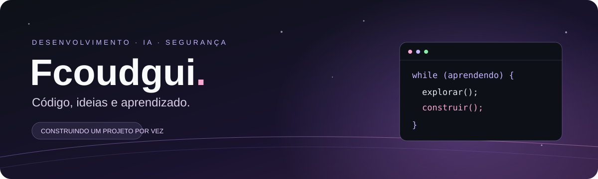

# Olá, eu sou Hernan👋

**Transformando aprendizado em projetos.**

Desenvolvimento de software · Inteligência artificial · Segurança digital

---

### 🧑‍💻 Sobre mim

Aprendo tecnologia colocando ideias em prática. Neste espaço, compartilho exercícios, protótipos e projetos que exploram código, interfaces e o uso de IA.

- **Desenvolvimento:** orientação a objetos, interfaces web e persistência de dados.
- **IA:** assistentes educacionais e engenharia de prompts.
- **Segurança:** boas práticas para proteger dados e credenciais.
- **Meu foco:** construir, entender e melhorar a cada projeto.

### 🛠️ Tecnologias nos meus projetos públicos

### 🚀 Projetos em destaque

| | Projeto | Ideia e implementação |
| :---: | --- | --- |
| 🌐 | **[HISYT](https://github.com/hernanseles/Hisyt_)** | Site institucional com React, TypeScript e Vite, em português, inglês e espanhol. Código em repositório privado. |
| 💬 | **[Next Comunica](https://github.com/hernanseles/NextComunica)** | Site institucional com HTML, CSS e JavaScript, animações e links de contato. Código em repositório privado. |
| 🛡️ | **[GuiaCiber](https://github.com/hernanseles/guia-ciber-assistente-virtual-ia)** | Assistente educacional de cibersegurança com base local, Python e interface web. |

### 🌱 Em construção

Aprofundando organização de código, documentação e boas práticas de desenvolvimento. Cada projeto registra o que já foi implementado e o que ainda pode evoluir.

---

**Uma ideia. Um projeto. Um novo aprendizado.**

